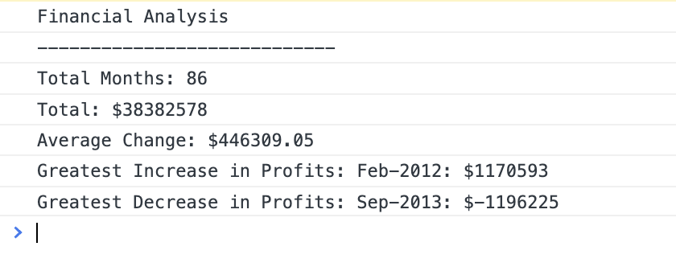

# Console-Finances
I created a Financial Analysis program with JavaScript. This program finds some data and prints it into the console.

#### The program calculates each of the following items;

- The total number of months included in the dataset.
- The net total amount of Profit/Losses over the entire period.
- The average of the changes in Profit/Losses over the entire period.
- The greatest increase in profits (date and amount) over the entire period.
- The greatest decrease in losses (date and amount) over the entire period.

## Result

